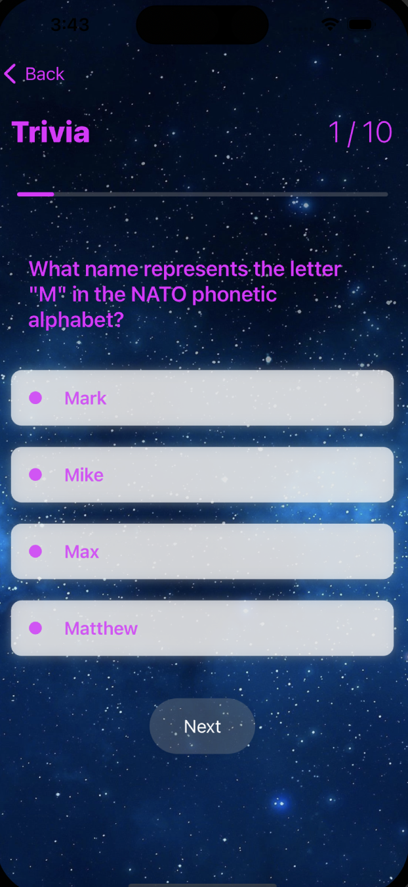
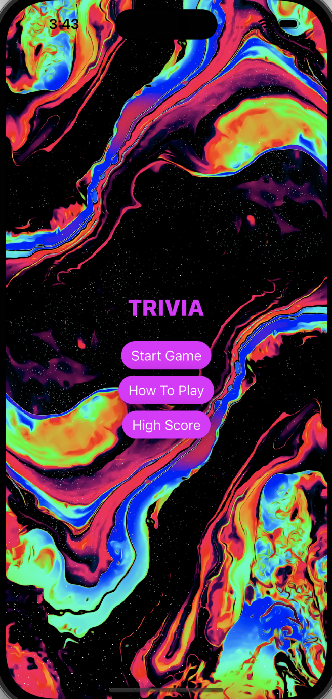

# Trivia

This Trivia app displays 10 general knowledge questions with 4 multiple choice answers

# Installation

Can be used with Xcode 14 and above. Compatible with iPhone and iPad with minimum iOS version 15.0.

# Framework

UIKit and SwiftUI

# Architecture

This application uses MVVMC architecture.

# Offline Storage

N/A

# Design Patterns

Async await.

# Testing

Units tests for success and failure situations using fake network manager.

# Screenshots

Game Screen
 

Home Screen
 |

